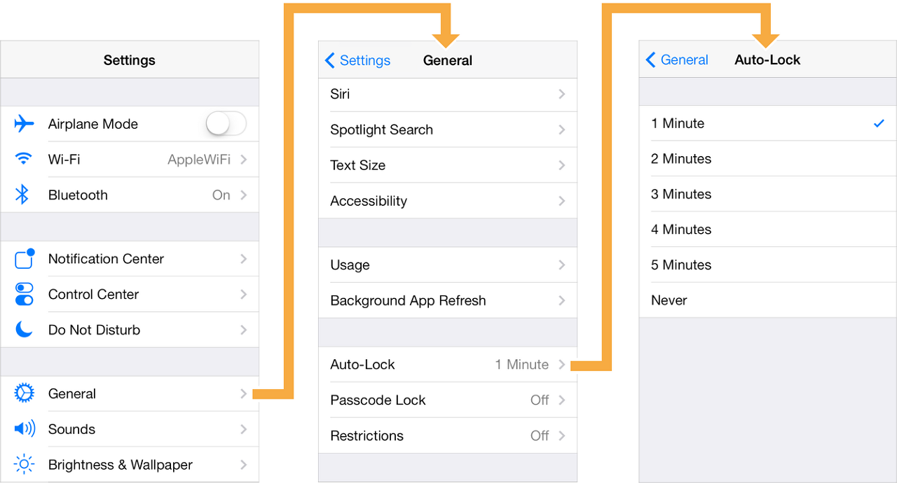

# View Controller는 앱의 근간을 이루는 객체입니다.
 
 
XCode를 통해 “Create a new Xcode project”를 하게 되면, 자동으로 ViewController가 하나 생기는데,
**모든 앱의 최소한 하나 이상의 뷰 컨트롤러**가 있어야 하기 때문이죠  




View Controller의 주된 역할은 화면 구성 요소들 ( = 뷰)를 관리 하는 것이지만, 
화면과 데이터 사이의 상호 작용까지 관리합니다!
 
 
 
View Controller에는 정말 많은 종류가 있습니다.
일단은 간략하게.. 함께 알아보도록 합시다… 
 
**# ViewController**
가장 기본이 되는 컨트롤러로서, 앱의 데이터와 표시될 외형을 연결해서
하나의 동적인 화면을 만들어내는 컨트롤러입니다.
 
이 컨트롤러에 연결된 클래스를 작성하려면
반드시!!! UIViewController 클래스를 상속받아야 합니다 



 
 
**# Navigation Controller**
네비게이션 컨트롤러는 뷰 컨트롤러 사이를 계층구조로 탐색할 수 있게 해주는 컨트롤러 입니다.
앱의 화면 이동에 대한 관리와 그에 연관된 처리를 담당해주죠! 
 
혼자서는 화면을 담당하지못하고, 다른 컨트롤러와 결합하여 화면을 구성해요

navigation interface 예제

 
 
네비게이션 컨트롤러를 직접 구현하고자 한다면 
class UINavigationController 를 상속받아야 합니다. 



 
navigation interface 예제에서 가장 최상위 root view는 바로 [Setting]  화면이겠죠
그러면 [General] 뷰와 [Auto-Lock]뷰는 모두 자식 뷰가 됩니당.
 
Root view 이외의 모든 view에서는 back button이 있어서, 
사용자가 계층구조에서 이전화면으로 돌아 갈 수 있습니다! 


 
 
**# Table View Controller**
내부에 리스트 형식의 테이블 뷰를 포함하고 있어, 여러 항목이나 데이터를 화면에 나열하기 위해 사용되는 컨트롤러입니다.

테이블 뷰 컨트롤러를 이용한 화면을 구성하기 위해선
UITableViewController를 상속받아 추가 구현하는 작업이 필요합니다.



 
 
 
 
**# Tab Bar Controller**
화면 하단에 탭 바 UI를 제공하고, 각각의 탭에 대해 뷰 컨트롤러를 선택하게 됩니다



탭 바 컨트롤러는 네비게이션 컨트롤러와 비슷해보이지만, 
탭 바 컨트롤러의 서브 뷰 컨트롤러들은 계층 구조가 아닌 수평적인 관계로 있습니다! 
 
 
 
이렇게 주요 컨트롤러를 알아보았는데요..
일단 간단하게 알아봤습니다. 자세히 구현하는 것은 다음 포스팅해서 할 겁니다! 
안뇽~
